# KS0548(KS0548A)Keyestudio PLUS V2 Development Board

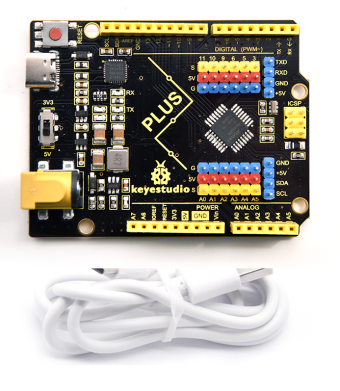

## 1. Description

Doing experiment with electronic products, we often program on the Arduino IDE development environment with Arduino series microcontrollers. 

Keyestudio Uno PLUS control board is fully compatible with Arduino IDE development environment. It is as same as the Arduino UNO R3 board. Moreover, some improvements we made highly strengthen its function(as shown below). In order to wire efficiently, we equip with a 1m USB cable with type-c interface for you.

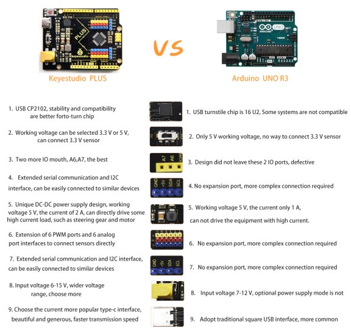

## 2. Specification

- Microcontroller：ATmega328PB-AU
- USB to serial chip: CP2102
- Working voltage: 5V or 3.3V (DIP switch control)
- External power: DC 6-15V (recommend 9V)
- Digital I / O pins: 14 (D0-D13)
- PWM channel: 6 (D3 D5 D6 D9 D10 D11)
- Analog input channel (ADC): 8 (A0-A7)

- Each I / O Port of DC output capability : 20 mA
- Output capability of 3.3V port: 50 mA
- Flash Memory: 32 KB (of which 0.5 KB is used by the bootloader)
- SRAM: 2 KB (ATmega328PB-AU)
- EEPROM: 1 KB (ATmega328PB-AU)
- Clock speed: 16MHz
- On-board LED pin: D13

## 3. Interfaces Description

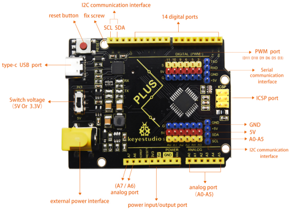

## 4. Specialized Function of Some Pins

- Serial communication interface: D0 is RX, D1 is TX
- PWM interface (pulse width modulation): D3 D5 D6 D9 D10 D11
- External interrupt interface: D2 (interrupt 0) and D3 (interrupt 1)
- SPI communication interface: D10 is SS, D11 is MOSI, D12 is MISO, D13 is SCK
- IIC communication port: A4 is SDA, A5 is SCL

## 5. Install Arduino IDE and Driver

### 5.1 Download the Arduino IDE

Open the browser and search:  https://www.arduino.cc/en/software, we will take WINDOWS system as an example to show you how to download and install.

You just need to click JUSTDOWNLOAD,then click the downloaded file to install it.And when the ZIP file is downloaded,you can directly unzip and start it.

### 5.2 Installing Driver

1、**Windows System**

**Checking the driver**

1. Connect the motherboard to the computer.

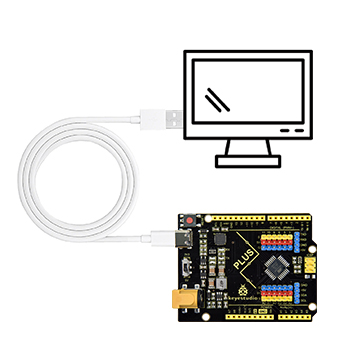

2. Open Device Manager，Open the device manager, if the prompt **"Silicon Labs CP210x USB to UART Bridge (COMx)"** appears to prove that the driver has been installed, please skip the **"Driver installation"** part.

**Manual driver installation**

1. Driver download

- Windowns System:[Windowns System driver](./Windows.7z)

2. Connect the motherboard to the computer, open the device manager, if there is a yellow exclamation mark in front of the driver in the picture, it proves that the driver is not installed, please download the driver and install it manually.

2、**MAC System**

**1 Checking the driver**

Connect the development board to the computer, according to [Tools] ---> [Port] to select the development board port (Note: If you can not confirm which port is the development board, please connect the motherboard to take pictures to record all the ports, and then unplug the development board to re-take pictures to record all the ports, and then compare to find the disappeared ports, and then unplug the motherboard after the disappeared ports is the port of the board, and then select the port on the line)If you can not recognize the port, please replace the computer USB port or around the phone cable to re-recognize the port, if it still does not work refer to the following steps to install the driver.

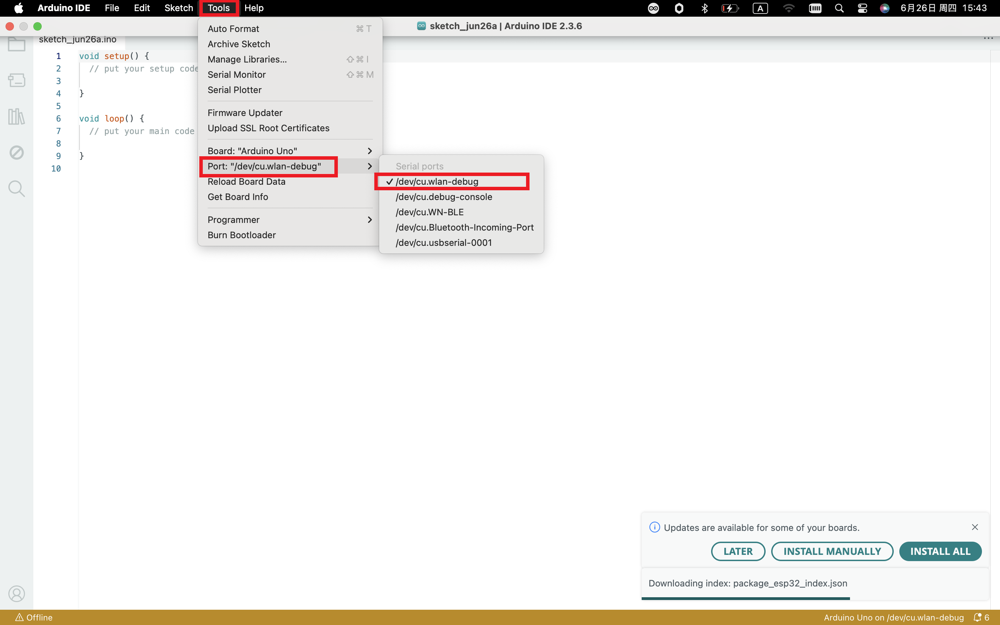

**2 Manual driver installation**

1. Driver download

​       Mac System:[Mac System driver](./Mac.7z)

2. double-click to decompress the downloaded driver zip package

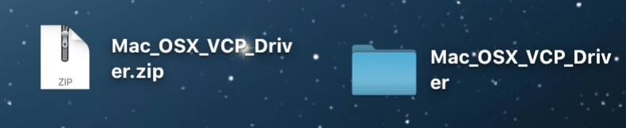

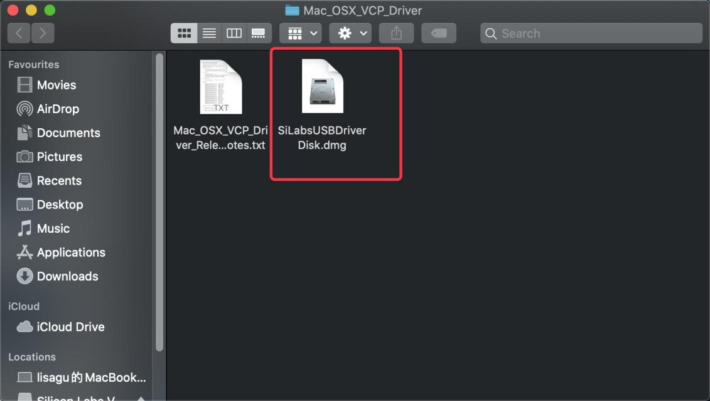

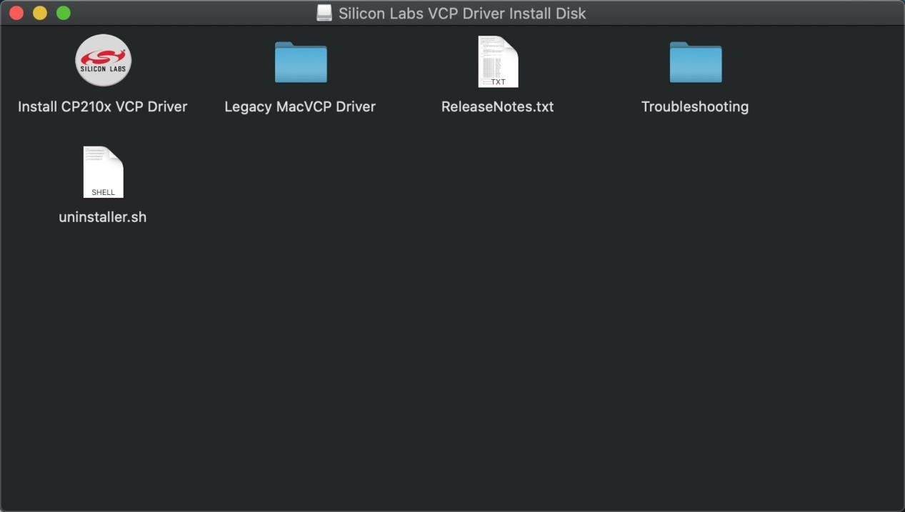

3. After that keep **"Next ”** installing until the installation is complete

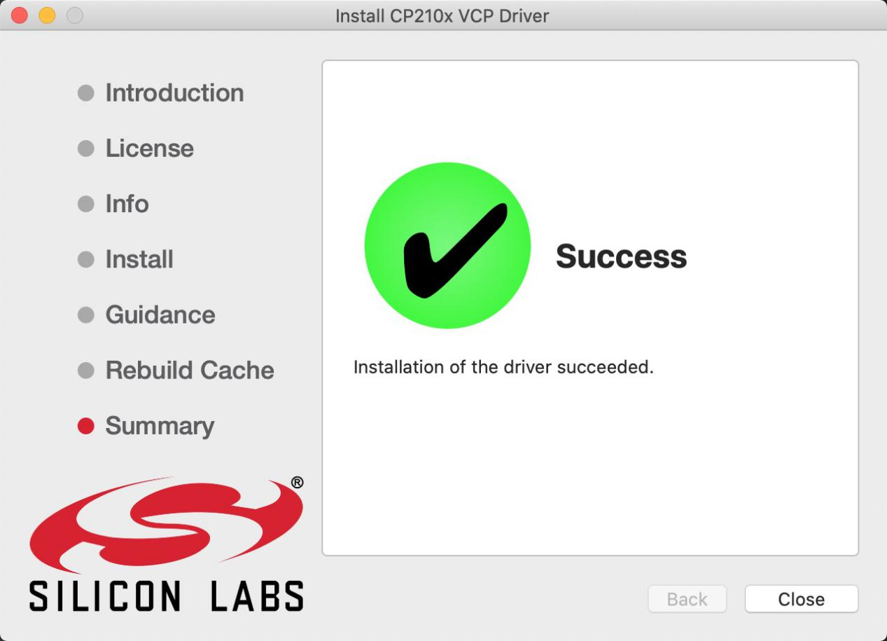

At this point, the port can be recognized by plugging in the board again.

4. Then go to the Arduino IDE, click on “Tools”, select the board Arduino Uno and the recognized development board port。

Clickto upload code and show “Done uploading”.

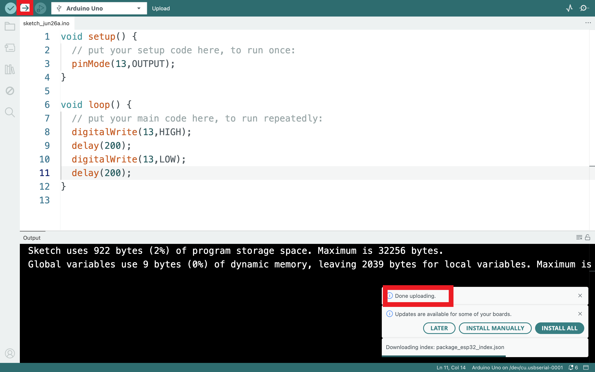

### 5.3 Set Arduino IDE 

Connecting the board to the computer.

### 5.4 Start First Program

Open the file to select Example, choose BLINK from BASIC, as shown below:

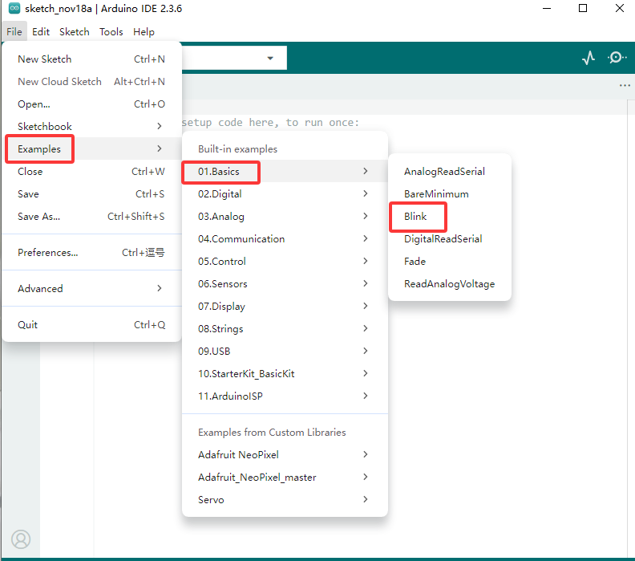

Set board and COM port, the corresponding board and COM port are shown on the lower right of IDE.

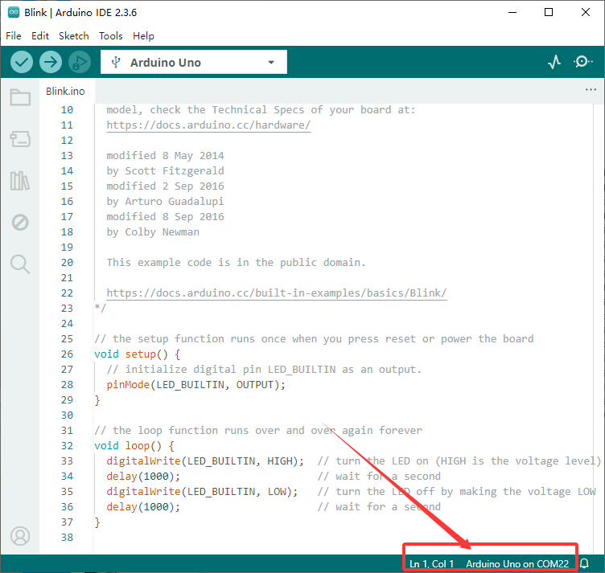

Clickto start compiling the program, check errors.

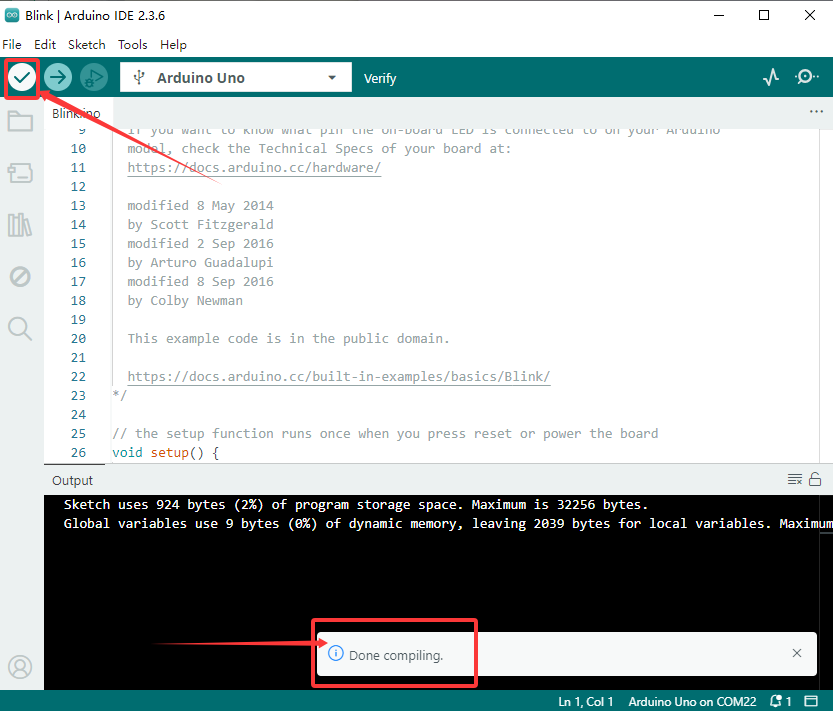

Clickto upload the program, upload successfully.

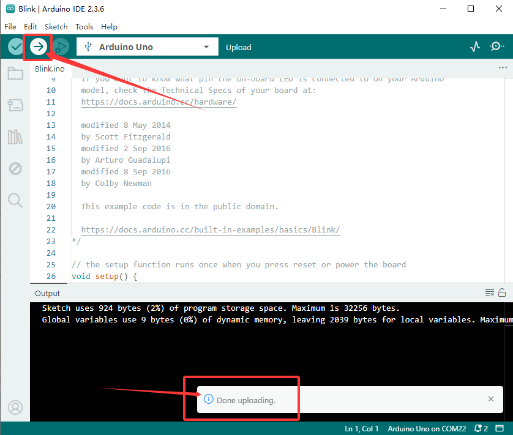

Upload the program successfully, the onboard LED lights on for 1s, lights off for 1s. Congratulation, you finish the first program.